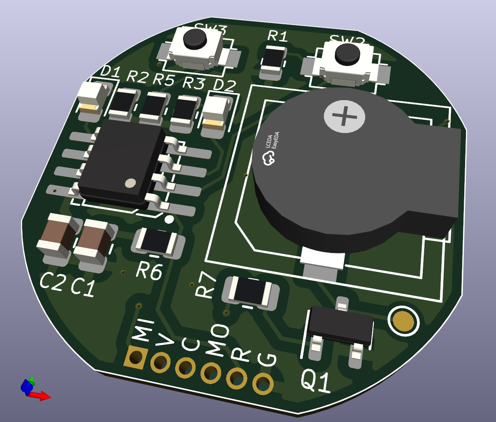

## General

This is essentially based on the idea of the original annoy-a-tron.

This will work with either a speaker or buzzer.  With a speaker it can also play tunes.

This is the one I am actually using for the ATtiny13a modules.

The ATtiny13a has very limited to 1k flash so you can't fit a lot in it.

I have since created a version with a flash chip so it can play samples but that is more complicated and expensive, these ones cost next to nothing so you can leave them in shopping centers, ubers, bus, work/etc and not really care that much.

## Hardware
The hardware basically works on all the Neep Neep boards:
  - https://gitlab.niffum.net/kicad/neepneep
  - https://github.com/niffumau/NeepNeep-KiCAD

I beleive version 6 of the board, Version 6 you only have to populate the following components:
  - Battery holder
  - C1, C2 (Power filter capacitors)
  - R6 (reset line)
  - R7, Q1, Buzzer
  - U1, Attiny13a-SSUR

Or just use the V7 one which i took those out of.  The V6 version just has everything for debugging.

I need to change the URL for the dev server that to include kicad in the name.

The ATTiny13a:
  - ATTINY13A-SSUR (LCSC C40382)

The switches I generally use:
  - TS342A2P-WZ (LCSC C557591)

The buzzer could be:
  - FUET-9650B-3V (LCSC C391032)
The speaker i generally use is:
 - YS-SBZ9032C03R16 (LCSC C409828)

## Debugging
I need to write this section but  some of the things:
  - #define BEEP_EVERY_CYCLE

## Neep Neep Selection

You can change what type of neep neep it is by setting defines in the main.h file.

There are two main variations:
1.  Speaker
2.  Buzzer

### Speaker Neep Neeps

Speaker Neep Neeps
  - Don't have IS_BUZZER or IS_SMOKE_ALARM Defined

### Buzzer Neep Neeps
Buzzer Neep neep:
  - #define IS_BUZZER
Smoke Alarm (BUZZER)
  - #define IS_SMOKE_ALARM

## Installation/Programming

Programmer USBASP, i use a clip that 1.27mm(Single row), 6p

I use VSCode. and the USBASP programmer.

1.  Set the type of neep neep (see the section for that:
    1.  Standard Speaker
    2.  Buzzer
        1.  Neep Neep Buzzer
        2.  Smoke Alarm Buzzer

2.  For new ATtiny13a's, you will most likely have to set the fuses.
    In VSCode, the platformio button.  Go under attiny13a > Platform > Setfuses

3.  Upload the code.
    In VSCode, the platformio button.  Go under attiny13a > General > Upload

